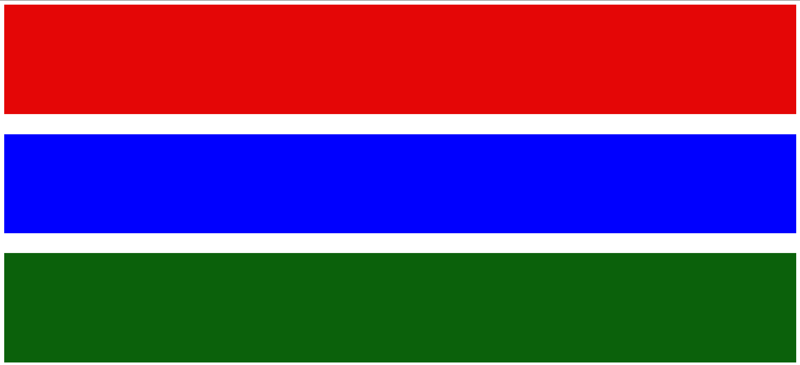

# Gambia Flag 🇬🇲

A simple visual representation of the national flag of Gambia created using HTML and CSS.

## 📝 Description
This project recreates the Gambia national flag using basic HTML structure and CSS styling.  
It focuses on understanding layout, spacing, and color alignment using div elements.

## 🚀 Features
- Clean three-color layout
- Accurate color separation
- Simple and minimal structure

## 🛠️ Technologies Used
- HTML5
- CSS3

## 📸 Preview

## 📚 What I Learned
- Structuring layouts using divs
- Working with margins and spacing
- Applying background colors accurately
- Improving CSS precision

## 📌 Author
Aashitosh Bhakare  
Frontend Developer

